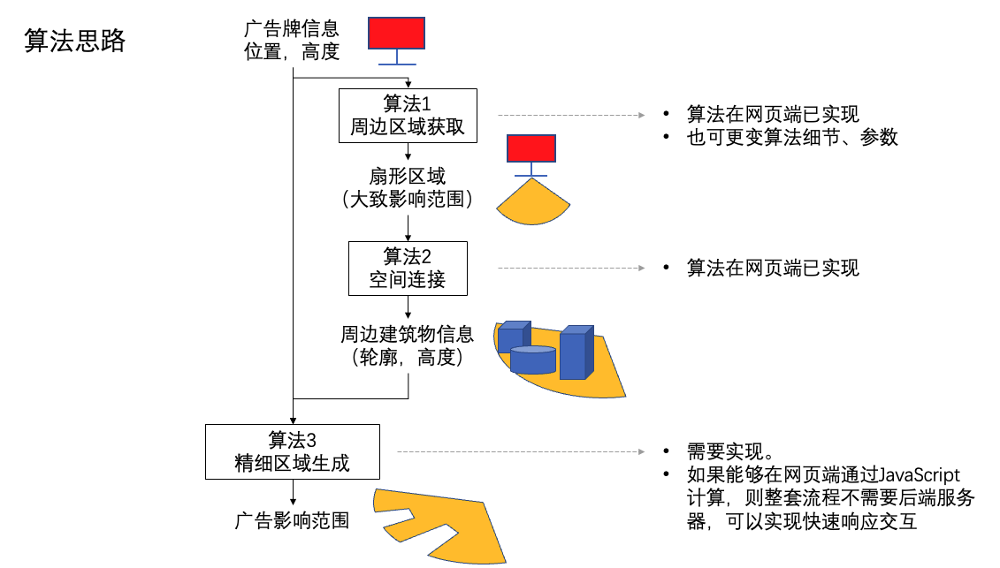

# 广告建筑三位阴影问题

# 整体思路



## 整体伪代码

```
/*可视面积计算*/
1、读取JSON文件
2、获取JSON的坐标系统，坐标系统转投影坐标系统，单位：m
3、从用户的输入中获取广告牌的点位信息（x,y,z）与方向信息（a)
4、计算该方向与坐标轴的方向夹角（da）
5、利用公式计算整个可视区域的范围（一个球形 参数：{o(x,y,z),R}）以及与地面的相交面（圆形 参数：{o1(x,y),r}），返回一个圆形公式的中点、半径等要素
6、（可选）坐标转换以及输出范围矢量文件

/*相交计算*/
7、读取建筑矢量
8、获取圆形的外接矩形，根据矩形获取内部的建筑标号（说明：矩形框的原因是为了计算容易，如果可以直接用圆形也可以）
9、循环判断：如果用户输入的广告牌高度（z）大于建筑高度（h）就求建筑物每条边的顶点（h）与水平面交点；如果低于建筑高度就求一个弧形区域
10、与可视区相交运算
11、坐标转换以及输出结果
```

## Step5:

```
Circle.py 中的cal_visual_area函数
def  计算可视化范围（坐标，广告牌分辨率，输入是否为角度制，眼睛分辨率（单位''，坐标轴角度）：

如果输入为角度：
	‘’转°；
	角度转弧度；
D = 广告牌分辨率/眼睛分辨率；
可视化半径 = D/2;
地面上的可视化半径 = np.sqrt((D**2)/4 -(z**2))
```

## Step9

```
For 范围内的建筑物：

    求建筑物每条棱的顶点高度的最大值MAX_h；
	If Max_h > 用户输入高度z：
		For 建筑物面：
			利用两点直线公式求建筑物顶点以及广告牌中心延长线与地面相交点
			Return 多变形四条边
	Else：
		For建筑物面：
			利用两点直线公式求广告牌地面点与建筑物面地面点延长线与可视区域的交点，
return一个圆弧型区域点

建筑物面积 = 建筑物遮挡投影面求相交；
圆内建筑物面积 = 圆内区域 && 建筑物面积
最后的可视区域 = 初始可视区域 – 圆内建筑物面积
```

## 原理说明


